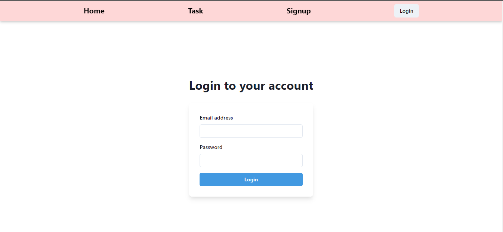
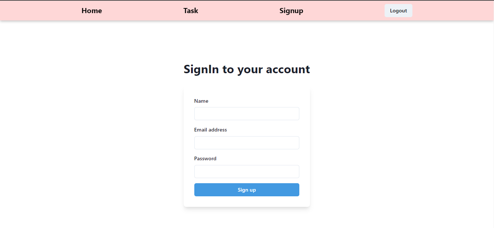
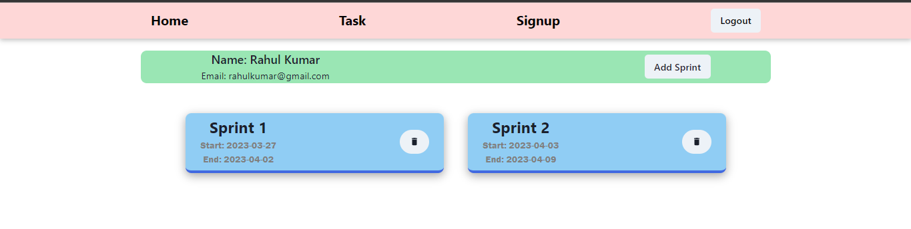
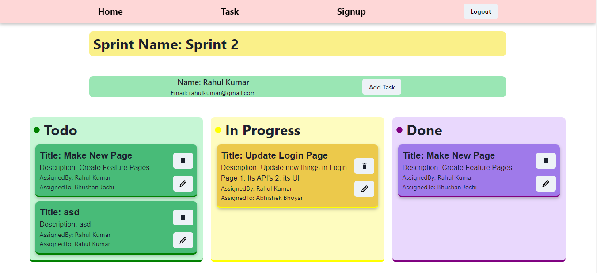
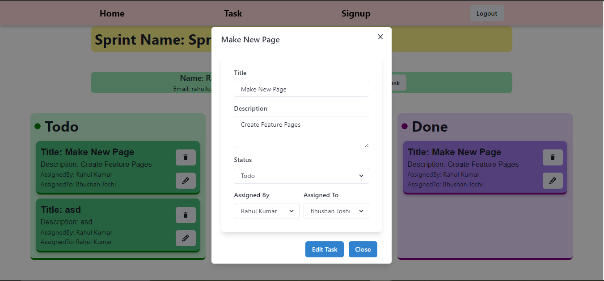
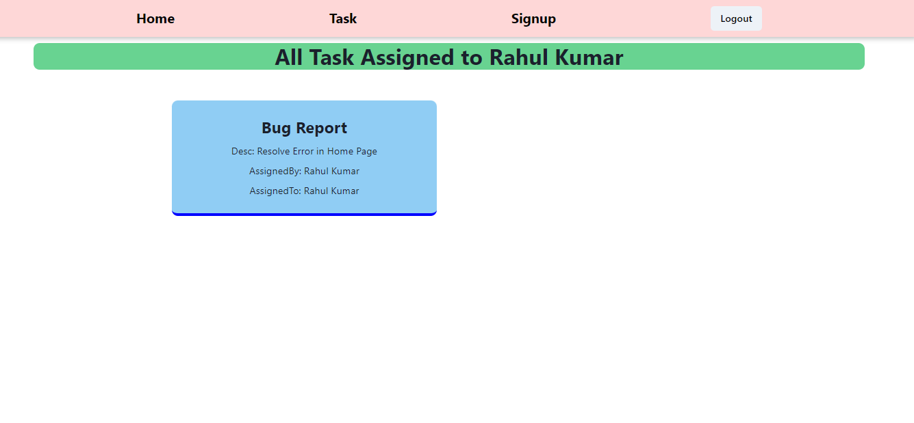

# _PayPal_

Project Links
 
Frontend:- https://pay-pal-front-end.vercel.app/login
 
Backend :- https://chocolate-abalone-gear.cyclic.app/

## Build with

<table  align=center>
  <tr>
 <td align=center> </td>
     <td align=center> </td>
    <td align=center> </td>
     <td align=center> </td>
  </tr><tr><td align=center>  </td>

  <td align=center> </td>
  <td align=center> </td></td>
  <td align=center> </td>
  </tr>

</table>

## Functionalities

# 🧑🏻 **Ashish Kohad**

- Github:[@Ashish Kohad](https://github.com/AshishKohad27)
- Linkedin: [Ashish Kohad](https://www.linkedin.com/in/ashish-kohad27/)
- Email: (kohadashish27@gmial.com)

<h1><i>Tech Stacks used </i></h1>

<ul>
<li>HTML</li>
<li>CSS</li>
<li>Javascript</li>
<li>React</li>
<li>Redux</li>
<li>NodeJs</li>
<li>MongoDB</li>
<li>Express</li>
</ul>

<h3><i>External libraries used </i></h3>

<ul>
<li>Chakra UI</li>
<li>Axios</li>
<li>Redux-Thunk</li>
<li>Redux</li>
</ul>

 
<h2 align="center" >✨ FUNCTIONALITIES (multi-user)✨<h2/>

Form validation
 
## Login Page

 

## Sign Up Page

 

## Home Page with Particular Sprint

## Task In Sprint

## Edit of Task In Sprint

## All Task of Individual User

 

